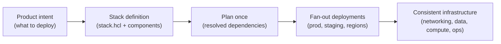
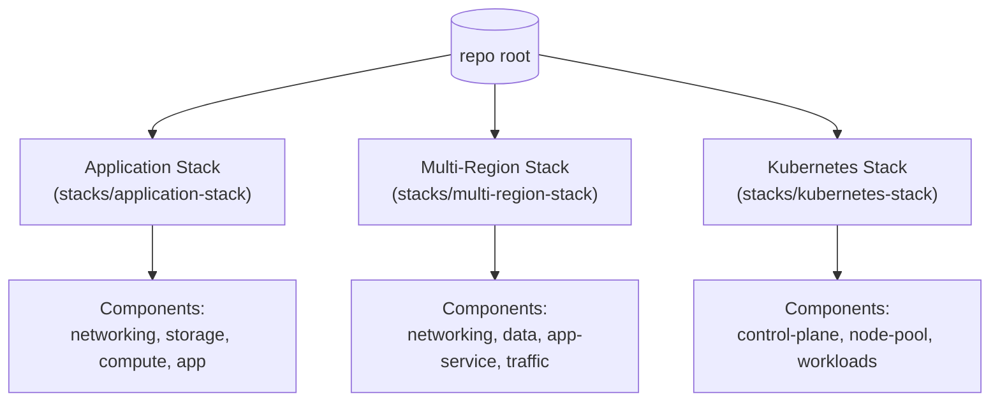
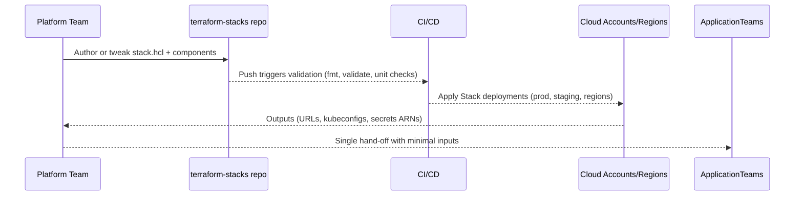

# terraform-stacks

A collection of production-ready **Terraform Stacks** that showcase enterprise patterns across full applications, multi-region fan-out, and Kubernetes platforms. Each stack is a single hand-off artifact—complete with documentation, diagrams, and well-commented code—that platform teams can share with application squads to accelerate delivery.

## Why Terraform Stacks?
Stacks let you compose multiple Terraform components into a single, versioned unit. Platform teams can ship one `stack.hcl` that wires dependencies (networking → storage → compute → operations) and expose only the inputs that matter. Consumers get a self-service experience without having to understand the underlying module graph.

Key advantages inspired by real-world platform teams and recent Stacks guidance:
- **Single artifact delivery:** one stack definition to deploy a whole footprint (network, data, compute, observability) with dependency ordering handled for you.
- **Consistent multi-environment rollouts:** define multiple deployments (prod, staging, regions, or accounts) in the Stack; changes fan out automatically without copy/paste Terraform.
- **Guardrails by default:** opinionated tags, encryption, IAM scoping, dashboards, and alarms shipped in every stack to meet enterprise baselines.
- **Speed with safety:** smaller plan surfaces and fewer moving parts versus layered, loosely coupled workspaces; easier to review, promote, and roll back.

## Repository at a glance

## Projects
Each project is ready to clone, customize, and deploy. Read the per-stack README for inputs, outputs, and diagrams.

- **[Application Stack (Project 1)](stacks/application-stack/README.md):** Deploy a full web application—VPC, ALB + ECS Fargate, RDS + Secrets Manager, dashboards, and alarms—as a single Stack with multi-deployment fan-out.
- **[Multi-Region Stack (Project 2)](stacks/multi-region-stack/README.md):** Stamp the same service across regions or accounts, including Route53 failover, ALB + ECS, and DynamoDB global tables, without duplicating Terraform.
- **[Kubernetes Stack (Project 3)](stacks/kubernetes-stack/README.md):** Provision EKS, managed node groups, and platform add-ons (ALB controller, metrics server) from one Stack, with IRSA wiring and kubeconfig outputs.

## How to use this repository
1. **Pick a Stack** that matches your use case and open its README for architecture, variables, and examples.
2. **Install Terraform with the Stacks feature flag** (or use Terraform Cloud/Enterprise Stacks). Run `terraform init` and `terraform plan` inside the Stack folder to preview deployments.
3. **Customize inputs** in `stack.hcl` deployments (e.g., regions, CIDRs, cluster sizes). The dependency graph is already wired for you.
4. **Promote with confidence:** commit changes, run CI, and apply across deployments knowing that tagging, encryption, and observability baselines are built in.

> These examples are inspired by the Stacks patterns described by HashiCorp and practitioners building paved roads for application teams.

## Inspirational workflow

## Connect
If this repository helps you ship infrastructure faster, follow along and connect: [LinkedIn](https://www.linkedin.com/in/huzefaaa2)

---

*Built to showcase how Terraform Stacks simplify complex deployments into a single, secure artifact that any team can run.*
A collection of production-ready Terraform Stacks that showcase enterprise patterns. Each Stack is self-contained with documentation, diagrams, and well-commented code.

## Projects

- [Application Stack (Project 1)](stacks/application-stack/README.md) – Deploy a full web application (networking, storage, compute, observability) as a single Stack with multi-deployment fan-out.
- [Multi-Region Stack (Project 2)](stacks/multi-region-stack/README.md) – Stamp the same service across regions and accounts without duplicating Terraform code.
- [Kubernetes Stack (Project 3)](stacks/kubernetes-stack/README.md) – Provision an EKS cluster, managed node groups, and platform add-ons from one Stack.
