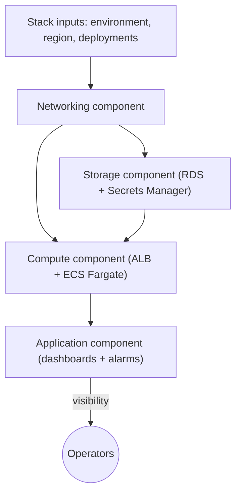

# Application Stack (Project 1)

An enterprise-ready Terraform Stack that deploys a full web application footprint—networking, storage, compute, and operational guardrails—as a single, repeatable unit. This project demonstrates how Stacks simplify complex deployments into a single, composable artifact that platform teams can hand to application owners.

## Why Stacks for full-application delivery?

- **Single hand-off:** Ship one `stack.hcl` that defines everything (network, storage, compute, dashboards) with dependency wiring handled for you.
- **Consistent rollouts:** Define multiple deployments in the Stack and fan out changes to every environment without duplicating code.
- **Guardrails baked in:** Shared tags, IAM least-privilege, encryption, and dashboards are embedded so every deployment meets the bar by default.

## Architecture



## Contents

- `stack.hcl` – Stack definition with four components and multi-deployment fan-out.
- `components/networking` – VPC, public/private subnets, and security groups sized for ALB/ECS/RDS.
- `components/storage` – Encrypted PostgreSQL instance, KMS key, and Secrets Manager password rotation seed.
- `components/compute` – ECS Fargate service fronted by an ALB with CloudWatch logging and circuit breakers.
- `components/application` – Dashboards and alarms that bind to the ALB/target group without extra inputs.

## Usage

1. Ensure you are using Terraform `>= 1.9.5` and have AWS credentials exported for each deployment target.
2. Update `deployments` in `stack.hcl` if you want to roll out to additional regions (e.g., `us-west-2` for DR).
3. (Optional) Override image, sizes, or subnet CIDRs by editing the component inputs in `stack.hcl`.
4. Initialize and plan with Stacks:

   ```bash
   terraform init
   terraform plan -stack=stacks/application-stack/stack.hcl
   ```

5. Apply to all configured deployments when ready:

   ```bash
   terraform apply -stack=stacks/application-stack/stack.hcl
   ```

## Component highlights

### Networking
- Multi-AZ VPC with tagged public/private subnets.
- ALB, app, and DB security groups with least-privilege ingress.

### Storage
- PostgreSQL with KMS encryption and Secrets Manager-stored credentials.
- DB subnet group pinned to private subnets and weekly backups.

### Compute
- ECS Fargate tasks with circuit breaker rollback, log streaming, and health checks.
- ALB listener + target group tied to the app security posture.

### Application observability
- CloudWatch dashboard summarizing ALB requests and ECS utilization.
- Latency and healthy host alarms bound to the discovered ALB and target group.

## Extending the Stack

- Add new deployments in `deployments` to replicate the stack in new regions.
- Swap `container_image` in the compute component for your service image; the Stack wires secrets and networking automatically.
- Attach additional components (e.g., Redis, CDN) by adding new `component` blocks and connecting outputs to inputs—no copy/paste required.

## Security & operations defaults

- KMS encryption for database and secrets, plus log retention defaults.
- IAM policies scoped to ECS tasks for reading only the required secret.
- Predictable tags applied everywhere for cost allocation and inventory.

