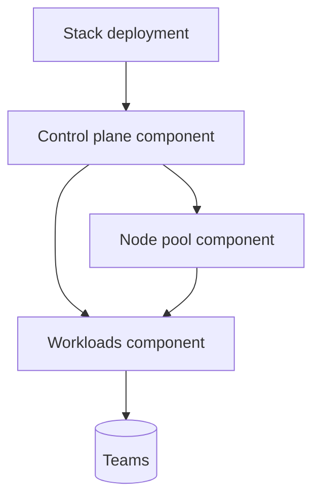

# Kubernetes Stack (Project 3)

A Stack that provisions an Amazon EKS control plane, managed node pool, and common platform add-ons so teams can deploy and
operate Kubernetes workloads from a single configuration.

## Why Stacks for Kubernetes?

- **Single artifact:** Deliver the cluster, node groups, and add-ons together without chaining multiple Terraform states.
- **Repeatable deployments:** Add more deployments in `stack.hcl` to stamp identical clusters across regions/accounts.
- **Operator-friendly:** Kubeconfig output, OIDC wiring, and add-ons are pre-wired for application teams.

## Architecture



## Contents

- `stack.hcl` – Stack definition with control plane, node pool, and workloads components.
- `components/control-plane` – EKS control plane, networking, and OIDC outputs.
- `components/node-pool` – Managed node group with autoscaling limits and taints/labels hooks.
- `components/workloads` – Helm releases for AWS Load Balancer Controller, Metrics Server, and a sample app.

## Usage

1. Ensure Terraform `>= 1.9.5`, AWS credentials, and kubectl/helm available locally.
2. Update `deployments` in `stack.hcl` for more regions or environments.
3. Apply the Stack:

   ```bash
   terraform init
   terraform apply -stack=stacks/kubernetes-stack/stack.hcl
   ```

4. Export the kubeconfig from outputs to start deploying workloads:

   ```bash
   terraform output kubeconfig > kubeconfig.yaml
   KUBECONFIG=kubeconfig.yaml kubectl get nodes
   ```

## Security & operations defaults

- KMS-encrypted EKS secrets and enabled control plane logging.
- Managed node groups with launch templates for SSH lockdown and IMDSv2 enforcement.
- Add-ons installed with IRSA (service account OIDC) for minimal IAM permissions.

## Extending the Stack

- Add more Helm releases in `components/workloads` to standardize platform tooling.
- Add new node groups (e.g., GPU) by duplicating the node pool component with different inputs.
- Mirror the deployment to new regions by adding deployments in `stack.hcl` with different `region` values.
