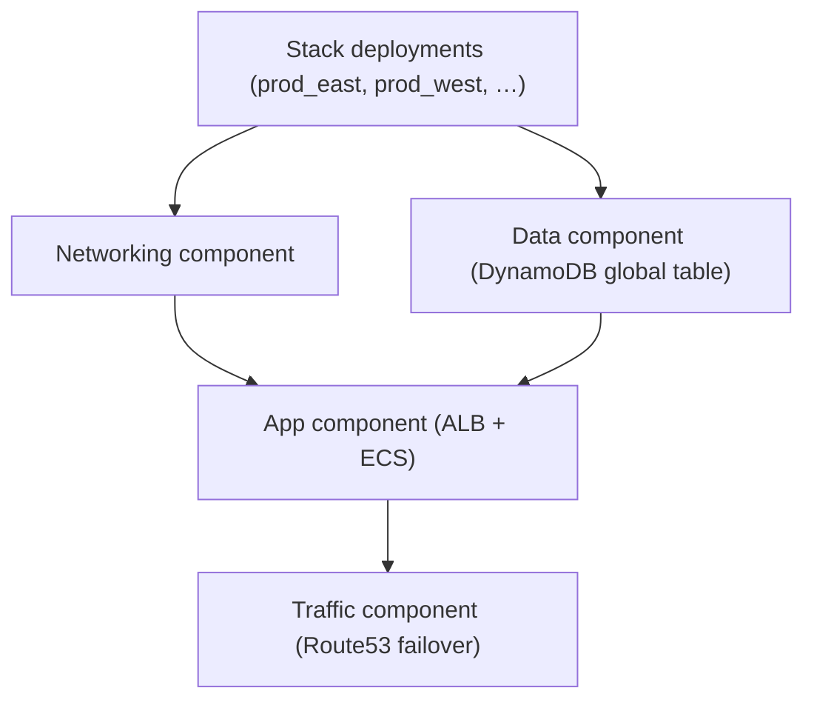

# Multi-Region Stack (Project 2)

A production-ready Stack that rolls out the same service to multiple AWS regions without duplicating Terraform code. Use this
Stack to fan out a VPC, DynamoDB global table, ECS service, and Route53 DNS endpoints to any number of regions with one `apply`.

## Why Stacks for multi-region delivery?

- **One configuration, many regions:** Add deployments in `stack.hcl` to stamp the service into new regions or accounts.
- **Coordinated rollouts:** Roll a change (e.g., image version, subnet CIDR) to all or some deployments from one plan.
- **Shared guardrails:** Tags, IAM, encryption, and health checks are embedded so every region meets the baseline.

## Architecture



## Contents

- `stack.hcl` – Stack definition with two sample deployments (`prod_east`, `prod_west`).
- `components/networking` – Regional VPC with public/private subnets and security groups.
- `components/data` – DynamoDB global table with optional backups and streams.
- `components/app-service` – ECS Fargate service fronted by an ALB and secured security groups.
- `components/traffic` – Route53 health checks and DNS records targeting the ALB per deployment.

## Usage

1. Ensure Terraform `>= 1.9.5` and AWS credentials for each region/account targeted.
2. Adjust `deployments` in `stack.hcl` to add or remove regions and set the right accounts.
3. Update component inputs (CIDRs, container image, zone name) as needed for your environment.
4. Plan and apply with Stacks:

   ```bash
   terraform init
   terraform plan -stack=stacks/multi-region-stack/stack.hcl
   terraform apply -stack=stacks/multi-region-stack/stack.hcl
   ```

## Security & operations defaults

- KMS encryption for DynamoDB table and ALB access logs.
- IAM roles scoped to the ECS task and least-privilege task execution.
- Health checks and failover records to keep traffic healthy across regions.

## Extending the Stack

- Add more deployments to expand to new regions.
- Swap the container image or task sizes to match your workload.
- Add more replicas to the DynamoDB table by extending `replica_regions` in the data component.
- Integrate CDN or WAF by adding new components and wiring outputs (ALB DNS) to them.
